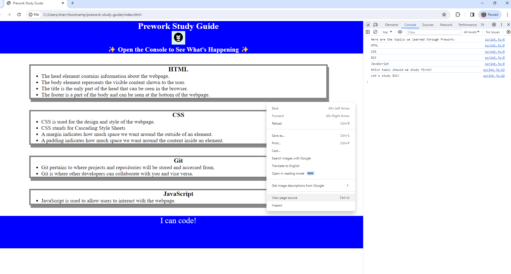

# Prework Study Guide

## Description

This project was created to give students an organized webpage to study their notes for prework.
As beginners, it is easy to get lost in all of the infrmoation coming in at once. This webpage organizes that information and allows students to see things more clearly.
By doing this project, I learned the basics of the three coding languages: HTML, CSS, and JavaScript. I also learned how to put all of these together to make a webpage.

## Installation

N/A

## Usage

 To interact with the page, right click on the webpage and click inspect. From there, click console and the programming will randomly choose a topic for you to study. Refresh the page for it to choose a different topic. 

## Credits

N/A

## License 

Please refer to the LICENSE in the repo.
